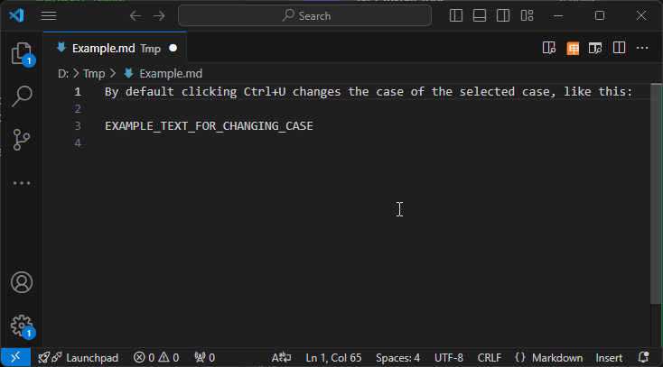
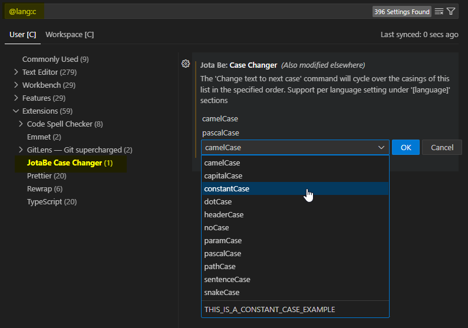

# JotaBe Case Changer

This extensions provides the `JotaBe: Change text to next case` command, bounded
by default to `Ctrl+U`, which allows to quickly change the case, cycling over
the list of cases specified in the configuration, like this:

The casing is applied to the current single-lines selection, or to the current
word if there is no selection.

The extension supports a global configuration, which can be overridden for each
language- You do that like with other extension, either editing the options in
the `[language]` section, or using the UI with the `@lang:language` specified,
which you can open with the command `Preferences: Configure Language Specific
Settings`, for ex. for C language:

In this case, the case of the text would cycle between `camelCase`, `pascalCase`
and `constantCase`.
